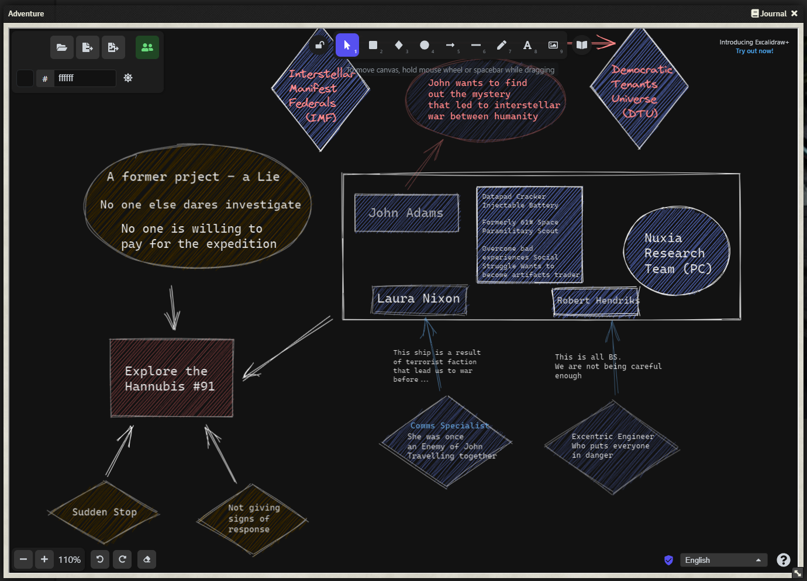
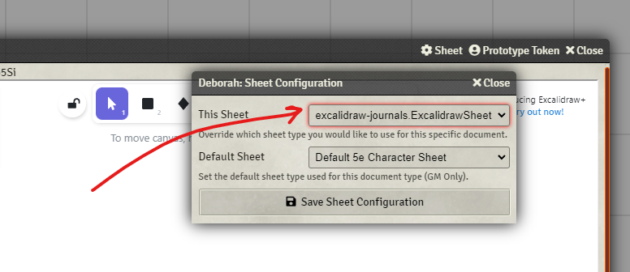
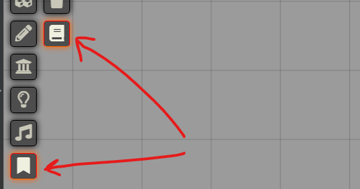

   
# ABANDONED

Please use [Journal Whiteboard](https://foundryvtt.com/packages/journal-whiteboard) instead, which is better and supported in Foundry V11.

Thank you for supporting this module while it lived :)

# Excalidraw Journals for Foundry VTT

Excalidraw is a free and open source collaborative virtual whiteboard for sketching and diagrams. With this, you can brainstorm together very easily with your players.

With this module, create Journal Entries or even Actors, using an Excalidraw board that automatically syncs with your players.

**This module is embedding Excalidraw Online version!**

_Maybe in the future I can work out a native implementation that stays within your world. Help is welcome!_

### _By JeansenVaars_ - [Invite me to a Coffee](https://ko-fi.com/jeansenvaars) :) if you enjoy this module!

### Example

## Usage

### 1. Journal Entries

### 2. As Actor Sheets

### 3. A private permanent Whiteboard (Private)

Check it out along my other modules (Search modules by JeansenVaars)
#### [This module was made for free, with joy, long nights and because of hundred windows needed it, so tons of coffee :D!](https://ko-fi.com/jeansenvaars)

## Caveats (Can be fixed eventually)

* This is embedding the online version of excalidraw (i.e. requires internet connection)
* Dark/Light mode not remembered
* Excalidraw Data not stored in your world, but rather online

### Appreciations

Asacolips, Javiondox and ronix for cool ideas and testing help.

### Future Ideas

Make Character Sheet adapters, so we can create character sheets with this system.

# Issues?
Go to the Issues section and let me know!

# License

[MIT](./LICENSE.md)

# Powered By

Thanks to JetBrains I can work on this project using **WebStorm**.
