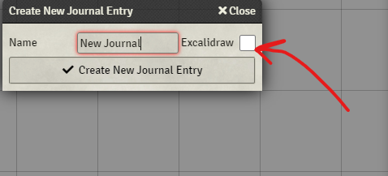
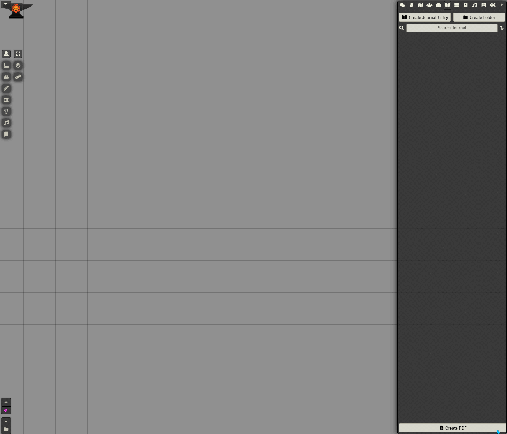

   
# Excalidraw Journals for Foundry VTT

Excalidraw is a free and open source collaborative whiteboarding application. Draw and move things around.

With this module, create Journal Entries using an Excalidraw iframe that automatically creates a shareable session.

It is using simple iframes. This is not doing anything special. Not yet exhaustively tested. Use at own risk. Have fun!.

https://excalidraw.com/

To use, simply enable this checkbox when creating a new Journal Entry:

### _By JeansenVaars_ - [Invite me to a Coffee](https://ko-fi.com/jeansenvaars) :) if you enjoy this module!

Check it out along my other modules (Search modules by JeansenVaars)
#### [This module was made for free, with joy, long nights and because of hundred windows needed it, so tons of coffee :D!](https://ko-fi.com/jeansenvaars)

# Issues?
Go to the Issues section and let me know!

# License

[MIT](./LICENSE.md)

# Powered By

Thanks to JetBrains I can work on this project using **WebStorm**.
